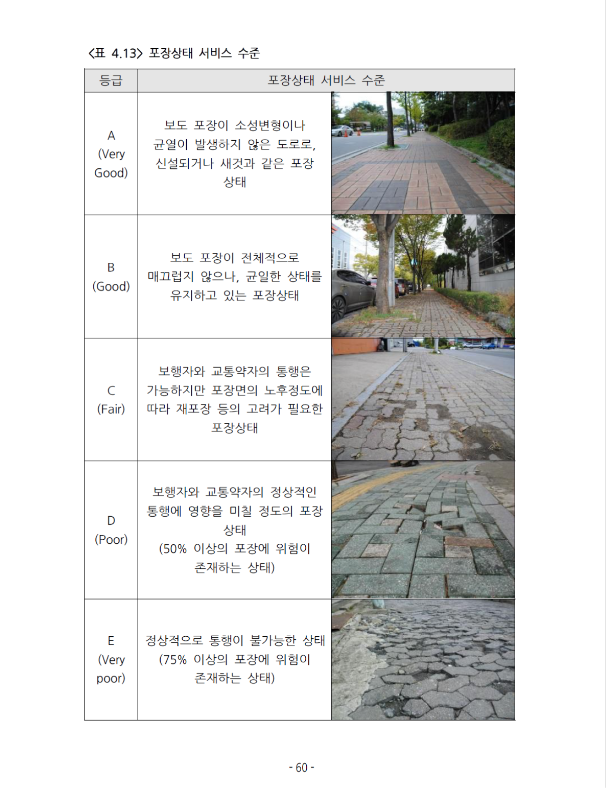
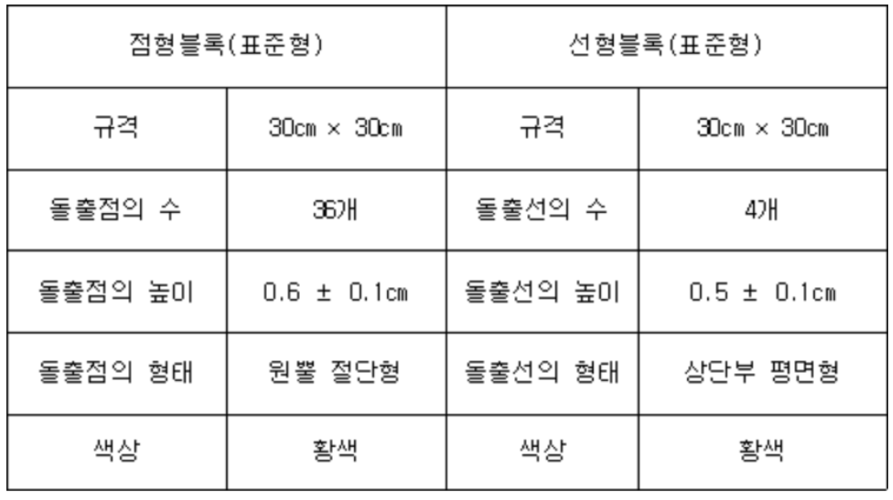

- 아래 내용은 피그마 보드에 더욱 세부적으로 작성되어 있음.

### [별표 1] 편의시설의 구조·재질등에 관한 세부기준(제2조제1항관련)(장애인ㆍ노인ㆍ임산부 등의 편의증진 보장에 관한 법률 시행규칙)
- 점자블록 규격 및 설치 방법에 대한 상세 
- 기준 확인
    | 상태 | 점형블록 | 선형블록 | 근거 |
    |------|---------|---------|------|
    | 설치규격 적합 | 5~7mm | 4~6mm | 시행규칙 |
    | 설치규격 미달 | 5mm 미만 | 4mm 미만 | 시행규칙 기준과 비교한 결과 |
    | 지침상 교체 | 3.5mm 이하 | 3.0mm 이하 | 국토부 관리지침 |
    | 파손 | 균열·탈락 등 | 균열·탈락 등 | 관리지침상 교체 |
    | 3.5~5mm / 3~4mm | 법정 등급 없음 | 법정 등급 없음 | 자체 '마모 진행' 구간 설정 가능 |

---
### 보도설치 및 관리지침 개정전문
- 보고서 양식 확인
    - 보도 관리대장(정기점검용)
    - 보도 포장 파손 현황 
- 보도 포장 상태의 조사 및 평가 절차
    
---
### 도로안전시설 설치 및 관리 지침
- 점자블록의 형태 및 규격
    
- 설치 방법
- 점자블록의 교체 기준
    - "점자블록이 제 기능을 발휘하기 위해서는 시각장애인이 감지 가능한 점자블록의 돌출면 높이가 중요하다. 점자블록 돌출면의 높이가 마모 등으로 인하여 일정 높이 이상으로 낮아져 그 기능을 수행하기 어려운 경우나, 점자블록이 파손된 경우에는 점자블록을 교체한다. 점형블록의 경우 돌출점의 높이가 3.5밀리미터 이하, 선형블록의 경우 돌출선의 높이가 3.0밀리미터 이하이면 시각장애인의 감지가 불가능하므로 점자블록을 교체한다."
---
### 도로법
- 관리자가 작성하고 관리해야 하는 도로 대장 관련
---
### 이동편의시설의 구조ᆞ재질 등에 관한 세부기준
- 점자 블록 설치 기준