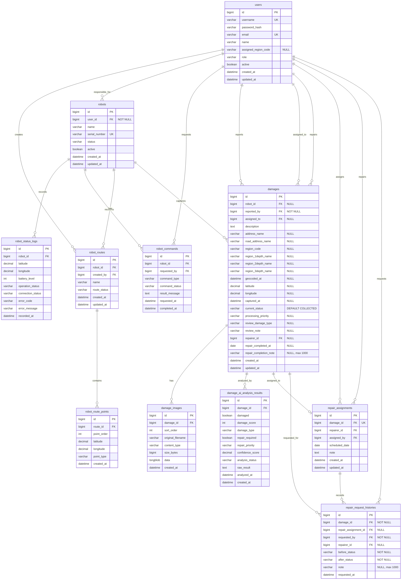

# Roady 백엔드 ERD

이 ERD는 Roady의 파손 탐지, 관리자 검토, 보수 요청/배정/완료까지의 백엔드 저장 구조를 기준으로 한다. 관리자 검토 단계의 상태와 처리 우선순위는 `damages.current_status`, `damages.processing_priority`에 직접 저장한다. 현재 보수 담당자와 완료 보고 정보는 `damages`에 저장하고, 보수 요청·수정·완료·취소 이력은 `repair_request_histories`에 누적한다.

## 1. 테이블 목록

| 테이블 | 역할 |
| --- | --- |
| `users` | 관리자, 점검 담당자, 보수 담당자, 일반 조회 사용자의 계정 정보를 관리한다. |
| `robots` | 로봇 또는 IoT 장치의 기본 정보를 관리한다. |
| `robot_status_logs` | 로봇의 위치, 배터리, 운행 상태, 통신 상태, 오류 정보를 주기적으로 저장한다. |
| `robot_commands` | 관제 서버에서 로봇에 내린 제어 명령과 처리 상태를 저장한다. |
| `robot_routes` | 로봇에게 할당된 점검 경로의 기본 정보를 저장한다. |
| `robot_route_points` | 점검 경로를 구성하는 좌표 목록을 순서대로 저장한다. |
| `damages` | 점자블록 파손 1건의 중심 정보를 저장한다. 위도, 경도, 촬영 시각, 현재 처리 상태 등이 들어간다. |
| `damage_images` | 파손 데이터에 연결된 이미지 파일 여러 장의 정보를 저장한다. |
| `damage_ai_analysis_results` | AI가 분석한 파손 여부, 파손 유형, 파손 점수, 신뢰도, 보수 필요 여부, 보수 우선순위를 저장한다. |
| `repair_assignments` | 보수 요청 시 담당자, 배정자, 예정일, 메모를 저장한다. |
| `repair_request_histories` | 보수 요청/완료/취소 및 배정/취소 시점의 상태 변경, 요청 메모, 담당자 배정 이력을 저장한다. 담당자 배정 없이 보수 진행 상태로 전환한 요청도 저장한다. |

## 2. 주요 관계

```text
users 1:N robots (responsible)
users 1:N robot_commands (requests)
users 1:N damages (reports)
users 1:N damages (assigned)
users 1:N damages (repairs)
users 1:N repair_assignments (assigns)
users 1:N repair_assignments (repairs)
users 1:N repair_request_histories (requests)

robots 1:N robot_status_logs
robots 1:N robot_commands
robots 1:N robot_routes
robots 1:N damages

robot_routes 1:N robot_route_points

damages 1:N damage_images
damages 1:N damage_ai_analysis_results
damages 0:1 repair_assignments
damages 1:N repair_request_histories
repair_assignments 0:N repair_request_histories
```

## 3. ERD



## 4. 상태 및 타입 후보

### 사용자 역할

| 값 | 의미 |
| --- | --- |
| `ADMIN` | 관리자 |
| `INSPECTOR` | 점검 담당자 |
| `REPAIRER` | 보수 담당자 |
| `VIEWER` | 일반 조회 사용자 |

### 로봇 상태

| 값 | 의미 |
| --- | --- |
| `STANDBY` | 대기 |
| `MOVING` | 이동 중 |
| `INSPECTING` | 점검 중 |
| `CHARGING` | 충전 중 |
| `STOPPED` | 정지 |
| `ERROR` | 오류 |

### 로봇 통신 상태

| 값 | 의미 |
| --- | --- |
| `CONNECTED` | 연결됨 |
| `DISCONNECTED` | 연결 끊김 |

### 로봇 제어 명령

| 값 | 의미 |
| --- | --- |
| `START_PATROL` | 순찰 시작 |
| `STOP_PATROL` | 순찰 종료 및 정지 |
| `EMERGENCY_STOP` | 즉시 긴급 정지 |
| `RETURN_HOME` | 스테이션 복귀 |
| `GET_STATUS` | 현재 상태 요청 |

### 로봇 명령 상태

| 값 | 의미 |
| --- | --- |
| `PENDING` | 명령 생성 후 처리 대기 |
| `IN_PROGRESS` | 로봇이 명령 처리 중 |
| `SUCCEEDED` | 명령 처리 성공 |
| `FAILED` | 명령 처리 실패 |
| `CANCELED` | 명령 취소 |

### 로봇 경로 상태

| 값 | 의미 |
| --- | --- |
| `CREATED` | 경로 생성 완료 |
| `DISPATCHED` | 로봇 전송 완료 |
| `COMPLETED` | 경로 수행 완료 |
| `CANCELED` | 경로 취소 |

### 로봇 경로점 유형

| 값 | 의미 |
| --- | --- |
| `START` | 시작 지점 |
| `WAYPOINT` | 경유 지점 |
| `DESTINATION` | 도착 지점 |

### 파손 처리 상태

| 값 | 의미 |
| --- | --- |
| `COLLECTED` | 수집 완료 |
| `AI_ANALYZING` | AI 분석중 |
| `AI_ANALYZED` | AI 분석완료 |
| `REQUESTED` | 검토 완료(요청 전) |
| `REPAIR_IN_PROGRESS` | 보수 중 |
| `REPAIR_COMPLETED` | 보수 완료 |
| `CANCELED` | 취소 |

### 파손 점수

| 값 | 의미 |
| --- | --- |
| `0` | 파손 없음 |
| `1~30` | 경미한 파손 |
| `31~70` | 보통 수준의 파손 |
| `71~100` | 심각한 파손 |

### 파손 유형

| 값 | 의미 |
| --- | --- |
| `LARGE_MISSING` | 큰 결손 |
| `SMALL_MISSING` | 작은 결손 |
| `WEAR` | 마모 |
| `CRACK` | 균열 |

AI 파손 유형은 응답에서 `LARGE_MISSING`, `SMALL_MISSING`, `WEAR`, `CRACK`으로 정규화한다. 기존 `MISSING`은 `LARGE_MISSING`, `BREAKAGE`는 `SMALL_MISSING`으로 해석한다.

### 보수 우선순위

| 값 | 의미 |
| --- | --- |
| `LOW` | 낮음 |
| `NORMAL` | 보통 |
| `HIGH` | 높음 |
| `URGENT` | 긴급 |

### 관리자 처리 우선순위

| 값 | 의미 |
| --- | --- |
| `LOW` | 낮음 |
| `NORMAL` | 보통 |
| `HIGH` | 높음 |
| `URGENT` | 긴급 |

### 관리자 판정 파손 유형

| 값 | 의미 |
| --- | --- |
| `LARGE_MISSING` | 큰 결손 |
| `SMALL_MISSING` | 작은 결손 |
| `WEAR` | 마모 |
| `CRACK` | 균열 |
| `OTHER` | 기타 |

### 파일 유형

| 값 | 의미 |
| --- | --- |
| `IMAGE` | 이미지 |

### 파손 등록 주체와 담당자

| 컬럼 | 의미 |
| --- | --- |
| `robots.user_id` | 로봇 책임자 사용자 ID |
| `users.assigned_region_code` | 사용자의 담당 시군구 코드. 시군구 코드 데이터와 조인해 담당 지역명을 해석한다. 미배정이면 `NULL` |
| `damages.robot_id` | 사진을 촬영한 로봇 ID. 사람이 직접 등록한 경우 `NULL` 가능 |
| `damages.reported_by` | 파손을 시스템에 등록한 사용자 ID. 로봇 자동 업로드 시 로봇 책임자 ID를 사용하며 `NOT NULL` |
| `damages.assigned_to` | 파손 처리 담당자 ID. 담당자 배정 전에는 `NULL` 가능 |
| `damages.region_code` | 파손 좌표를 카카오 행정구역 API로 변환해 저장한 시군구 코드. 지역 필터 조건으로 사용하며 변환 전에는 `NULL` 가능 |
| `damages.processing_priority` | 관리자가 보수 필요로 판정한 경우의 처리 우선순위. 판정 되돌리기 또는 취소 시 `NULL` |
| `damages.review_damage_type` | 관리자가 판정한 파손 유형. 기존 데이터는 보정하지 않고 `NULL` 유지 |
| `damages.review_note` | 관리자 판정 비고. 공백은 `NULL`, 최대 1,000자 |
| `damages.repairer_id` | 현재 보수 요청을 배정받은 `REPAIRER` 역할 사용자 ID. 미지정 또는 요청 취소 후에는 `NULL` |
| `damages.repair_completed_at` | 실제 보수 완료 일자. 서버 처리 시각인 `updated_at`과 별도로 저장하며 완료 전에는 `NULL` |
| `damages.repair_completion_note` | 보수 완료 보고 메모. 공백은 `NULL`, 최대 1,000자 |
| `repair_assignments.repairer_id` | 보수 요청을 배정받은 보수 담당자 ID |
| `repair_assignments.assigned_by` | 보수 요청을 생성하거나 배정한 관리자/점검 담당자 ID |
| `repair_request_histories.repair_assignment_id` | 보수 배정과 연결된 이력인 경우 배정 ID를 저장한다. 담당자 배정 없이 보수 진행 상태로 전환한 요청은 `NULL` |
| `repair_request_histories.repairer_id` | 보수 담당자가 지정된 이력인 경우 담당자 ID를 저장한다. 담당자 배정 없이 보수 진행 상태로 전환한 요청은 `NULL` |
| `repair_request_histories.note` | 요청 메모. 공백은 `NULL`, 최대 1,000자 |
| `repair_request_histories` | 보수 요청/완료/취소 및 배정/취소 시점의 상태 변경과 담당자 배정 기록을 저장한다. 관리자 검토 이력과는 분리한다. |

## 5. 주요 조회 인덱스

| 인덱스 | 컬럼 | 대상 조회 |
| --- | --- | --- |
| `idx_damages_created_at_id` | `created_at DESC, id DESC` | 전체 파손 기간 검색 및 최신순 페이지 조회 |
| `idx_damages_status_created_at_id` | `current_status, created_at DESC, id DESC` | 처리 상태별 기간 검색 및 최신순 페이지 조회 |
| `idx_damages_robot_created_at` | `robot_id, created_at` | 로봇별 파손 검색 |
| `idx_damages_assigned_to_created_at` | `assigned_to, created_at` | 담당자별 파손 검색 |
| `idx_damages_repairer_created_at` | `repairer_id, created_at` | 현재 보수 담당자별 파손 검색 |
| `idx_users_assigned_region_code` | `assigned_region_code` | 담당 시군구 코드별 사용자 조회 |
| `idx_damages_address_name` | `address_name` | 지번 주소 키워드 검색 |
| `idx_damages_road_address_name` | `road_address_name` | 도로명 주소 키워드 검색 |
| `idx_damages_region_code_created_at` | `region_code, created_at DESC, id DESC` | 시군구 코드와 기간 조건을 함께 사용하는 파손 검색 |
| `idx_damage_images_damage_sort_order` | `damage_id, sort_order` | 목록의 파손별 이미지 수 및 이미지 순서 조회 |
| `idx_repair_assignments_damage_id` | `damage_id` | 파손별 보수 배정 단건 조회. 보수 배정 구현 시 추가 |
| `idx_repair_assignments_repairer_created_at` | `repairer_id, created_at DESC` | 보수 담당자별 배정 목록 조회. 보수 배정 구현 시 추가 |
| `idx_repair_request_histories_damage_requested_at` | `damage_id, requested_at DESC` | 파손별 보수 요청/배정/취소 이력 최신순 조회 |
| `idx_repair_request_histories_assignment_requested_at` | `repair_assignment_id, requested_at DESC` | 보수 배정과 연결된 요청/취소 이력 조회 |

현재 구현된 테이블의 인덱스는 신규 데이터베이스에서 `schema.sql`의 테이블 생성 과정에 적용된다. 보수 진행 전환 API에서 사용하는 `repair_request_histories` 인덱스는 `schema.sql`에 정의되어 있고, 보수 배정 테이블 인덱스는 보수 배정 기능 구현 시 `schema.sql`에 추가한다.

- 최신 컬럼은 있지만 대시보드 인덱스만 없는 데이터베이스: `docs/sql/damage-dashboard-indexes.sql`을 한 번 실행한다.
- `created_by`를 사용하는 구버전 `damages` 테이블: `docs/sql/migrate-damages-dashboard.sql`을 한 번 실행한다. 기존 `created_by` 값은 `reported_by`로 보존된다.
- 담당 시군구 코드가 없는 구버전 `users` 테이블: `docs/sql/add-user-assigned-region-code-field.sql`을 한 번 실행한다.
- 주소/행정구역 필드가 없는 구버전 `damages` 테이블: `docs/sql/add-damage-geocoding-fields.sql`, `docs/sql/add-damage-region-code-field.sql`을 순서대로 한 번 실행한다.
- 파손 유형 컬럼이 없는 구버전 `damage_ai_analysis_results` 테이블: `docs/sql/add-damage-ai-analysis-damage-type.sql`을 한 번 실행한다.
- 관리자 처리 우선순위 컬럼이 없는 구버전 `damages` 테이블: `docs/sql/add-damage-processing-priority.sql`을 한 번 실행한다.
- 관리자 판정 파손 유형/비고 컬럼이 없는 구버전 `damages` 테이블: `docs/sql/add-damage-review-fields.sql`을 한 번 실행한다. 기존 데이터의 판정값은 보정하지 않고 `NULL`로 유지한다.
- 보수 담당자/완료 보고 컬럼이 없는 구버전 `damages` 테이블: `docs/sql/add-damage-repair-management-fields.sql`을 한 번 실행한다. 기존 데이터는 세 컬럼 모두 `NULL`로 유지한다.

대표 조회 쿼리는 다음 실행계획을 확인한다.

```sql
EXPLAIN
SELECT d.id
FROM damages d
WHERE d.created_at >= '2026-07-01 00:00:00'
  AND d.created_at < '2026-08-01 00:00:00'
ORDER BY d.created_at DESC, d.id DESC
LIMIT 0, 20;

EXPLAIN
SELECT d.id
FROM damages d
WHERE d.current_status = 'AI_ANALYZED'
  AND d.created_at >= '2026-07-01 00:00:00'
  AND d.created_at < '2026-08-01 00:00:00'
ORDER BY d.created_at DESC, d.id DESC
LIMIT 0, 20;
```
