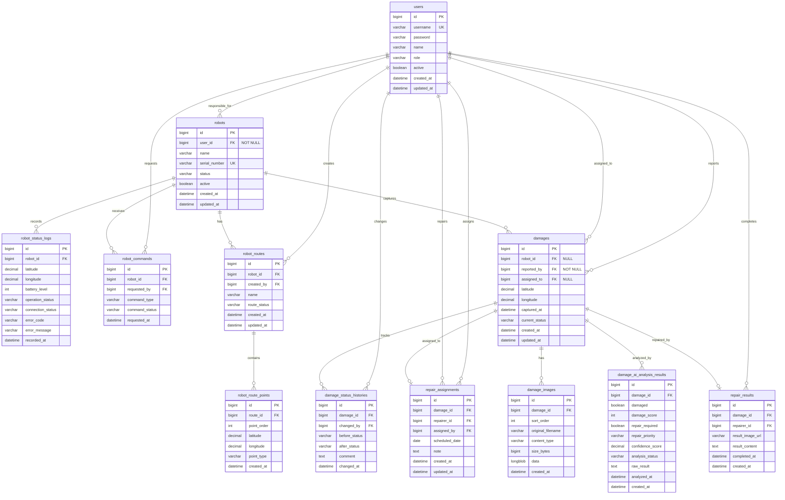

# Roady 백엔드 ERD

## 1. 테이블 목록

| 테이블 | 역할 |
| --- | --- |
| `users` | 관리자, 점검 담당자, 보수 담당자, 일반 조회 사용자의 계정 정보를 관리한다. |
| `robots` | 로봇 또는 IoT 장치의 기본 정보를 관리한다. |
| `robot_status_logs` | 로봇의 위치, 배터리, 운행 상태, 통신 상태, 오류 정보를 주기적으로 저장한다. |
| `robot_commands` | 관제 서버에서 로봇에 내린 제어 명령과 처리 상태를 저장한다. |
| `robot_routes` | 로봇에게 할당된 점검 경로의 기본 정보를 저장한다. |
| `robot_route_points` | 점검 경로를 구성하는 좌표 목록을 순서대로 저장한다. |
| `damages` | 점자블록 파손 1건의 중심 정보를 저장한다. 위도, 경도, 촬영 시각, 현재 처리 상태 등이 들어간다. |
| `damage_images` | 파손 데이터에 연결된 이미지 파일 여러 장의 정보를 저장한다. |
| `damage_ai_analysis_results` | AI가 분석한 파손 여부, 파손 점수, 신뢰도, 보수 필요 여부, 보수 우선순위를 저장한다. |
| `damage_status_histories` | 파손 데이터의 처리 상태 변경 이력을 저장한다. |
| `repair_assignments` | 파손 건에 대한 보수 담당자 배정과 보수 예정일을 저장한다. |
| `repair_results` | 보수 완료 결과, 보수 내용, 완료 이미지 정보를 저장한다. |

## 2. 주요 관계

```text
users 1:N damage_status_histories
users 1:N repair_assignments
users 1:N repair_results
users 1:N robots (responsible)
users 1:N robot_commands (requests)
users 1:N damages (reports)
users 1:N damages (assigned)

robots 1:N robot_status_logs
robots 1:N robot_commands
robots 1:N robot_routes
robots 1:N damages

robot_routes 1:N robot_route_points

damages 1:N damage_images
damages 1:N damage_ai_analysis_results
damages 1:N damage_status_histories
damages 0:1 repair_assignments
damages 0:1 repair_results
```

## 3. ERD



## 4. 상태 및 타입 후보

### 사용자 역할

| 값 | 의미 |
| --- | --- |
| `ADMIN` | 관리자 |
| `INSPECTOR` | 점검 담당자 |
| `REPAIRER` | 보수 담당자 |
| `VIEWER` | 일반 조회 사용자 |

### 로봇 상태

| 값 | 의미 |
| --- | --- |
| `STANDBY` | 대기 |
| `MOVING` | 이동 중 |
| `INSPECTING` | 점검 중 |
| `CHARGING` | 충전 중 |
| `STOPPED` | 정지 |
| `ERROR` | 오류 |

### 로봇 통신 상태

| 값 | 의미 |
| --- | --- |
| `CONNECTED` | 연결됨 |
| `DISCONNECTED` | 연결 끊김 |

### 로봇 제어 명령

| 값 | 의미 |
| --- | --- |
| `START_PATROL` | 순찰 시작 |
| `STOP_PATROL` | 순찰 종료 및 정지 |
| `EMERGENCY_STOP` | 즉시 긴급 정지 |
| `RETURN_HOME` | 스테이션 복귀 |
| `GET_STATUS` | 현재 상태 요청 |

### 로봇 명령 상태

| 값 | 의미 |
| --- | --- |
| `PENDING` | 명령 생성 후 로봇 처리 대기 |

### 파손 처리 상태

| 값 | 의미 |
| --- | --- |
| `COLLECTED` | 수집 완료 |
| `REVIEW_REQUIRED` | 검토 필요 |
| `RECEIVED` | 접수 완료. 보수가 필요한 건으로 접수된 상태 |
| `REPAIR_SCHEDULED` | 보수 예정 |
| `REPAIRING` | 보수 진행 중 |
| `REPAIR_COMPLETED` | 보수 완료 |
| `REPAIR_NOT_REQUIRED` | 보수 불필요 |

### 파손 점수

| 값 | 의미 |
| --- | --- |
| `0` | 파손 없음 |
| `1~30` | 경미한 파손 |
| `31~70` | 보통 수준의 파손 |
| `71~100` | 심각한 파손 |

### 보수 우선순위

| 값 | 의미 |
| --- | --- |
| `LOW` | 낮음 |
| `NORMAL` | 보통 |
| `HIGH` | 높음 |
| `URGENT` | 긴급 |

### 파일 유형

| 값 | 의미 |
| --- | --- |
| `IMAGE` | 이미지 |

### 파손 등록 주체와 담당자

| 컬럼 | 의미 |
| --- | --- |
| `robots.user_id` | 로봇 책임자 사용자 ID |
| `damages.robot_id` | 사진을 촬영한 로봇 ID. 사람이 직접 등록한 경우 `NULL` 가능 |
| `damages.reported_by` | 파손을 시스템에 등록한 사용자 ID. 로봇 자동 업로드 시 로봇 책임자 ID를 사용하며 `NOT NULL` |
| `damages.assigned_to` | 파손 처리 담당자 ID. 담당자 배정 전에는 `NULL` 가능 |
